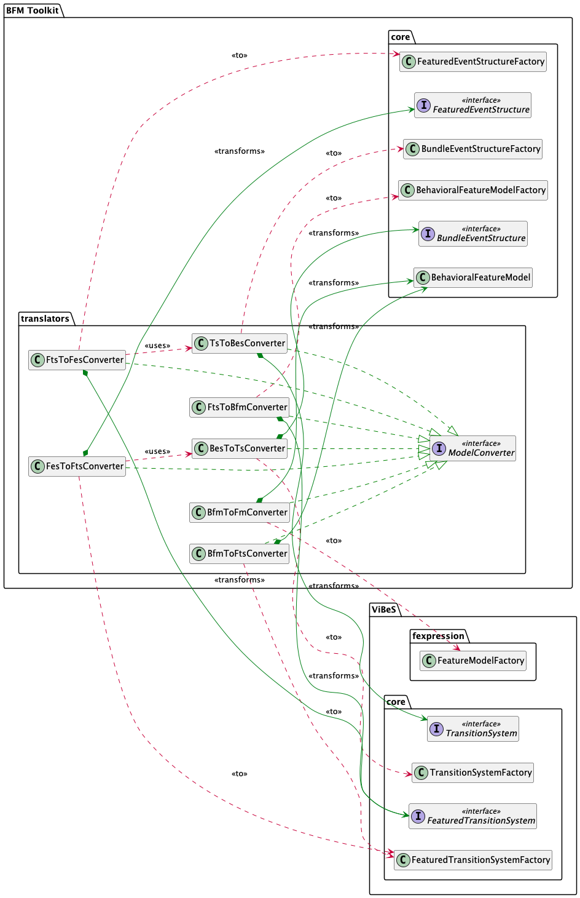

# Behavioral Feature Model Toolkit

[](https://maven.apache.org)

A toolkit for modeling, transforming, and analyzing **Behavioral Feature Models (BFMs)** and related behavioral models in Software Product Lines (SPLs).

## 🧠 Overview

**Behavioral Feature Models (BFMs)** unify structural and behavioral variability within SPLs by extending traditional feature models: each feature is enriched with an associated behavioral specification, and inter-feature behavioral constraints can be declared. The behavior of a product emerges from the composition of its selected features.

This toolkit includes:

* Core data structures for BFMs and related models (i.e., BESs, FESs, FTSs, TSs and FMs)
* Translation algorithms between behavioral modeling formalisms
* IO utilities and format converters
* Interoperability with [UVL](https://universal-variability-language.github.io/) and [VIBeS](https://github.com/xdevroey/vibes)

Our implementation builds upon [VIBeS](https://github.com/xdevroey/vibes), a library for Featured Transition System (FTS)
manipulation, and integrates the **Universal Variability Language (UVL)** \[[1](#references), [2](#references)]
facilitating interoperability within the SPL and behavioral modeling ecosystems and offering modern feature modeling support.

---

## 🧩 Features

* ✅ Core modeling support for:

  * **Behavioral Feature Models (BFM)**
  * **Behavioral Event Structures (BES)**
  * **Featured Event Structures (FES)**
  * **Featured Transition Systems (FTS)**
  * **Transition Systems (TS)**
  * **Feature Models (FM)**
* 🔄 Bidirectional translations between formalisms
* 📂 IO support for XML (all formalisms) and DOT (TSs/FTSs)
* 📊 Benchmark models and integration testing infrastructure
* 🔗 Tool compatibility with VIBeS and UVL

---

## 📁 Project Structure

```bash
.
├── pom.xml                    # Maven build configuration
├── diagrams/                  # Class diagrams for core packages (BFM toolkit and VIBeS)
│   ├── png/                   # Rendered diagrams in PNG format
│   └── puml/                  # Source diagrams in PlantUML format
├── src/
│   ├── main/
│   │   ├── java/              # Core Java sources
│   │   │   └── uk/kcl/info/bfm/
│   │   │       ├── *.java         # Core data structure classes and logic
│   │   │       ├── exceptions/    # Exception definitions
│   │   │       ├── io/xml/        # XML read/write utilities
│   │   │       ├── utils/         # Labeling & translation algorithms
│   │   │       └── Main.java      # Main entry point
│   │   └── resources/             # Example input models (.bfm, .fes, etc.)
│   └── test/
│       ├── java/
│       │   └── uk/kcl/info/bfm/
│       │       ├── integration/   # Integration tests
│       │       ├── unit/          # Unit tests
│       │       └── utils/         # Utility class to generate (F)TS traces
│       └── resources/testcases/   # Test model inputs
└── target/                        # Compiled artifacts
```

### 🔍 Class Diagrams

To better understand the internal structure, we provide class diagrams for each major package or module.
The project is organized around two core packages:

* One dedicated to the data structures that define our modeling formalisms
* One focused on the model transformation algorithms between those formalisms

Since the data structures build on and extend concepts from [VIBeS](https://github.com/sfortz/vibes), we also include class 
diagrams for two relevant [VIBeS](https://github.com/sfortz/vibes) modules to illustrate their integration and dependencies.

> Note: Only key classes and meaningful relationships are shown—those central to the design and behavior of the toolkit.

* **BFM Toolkit – Core Components**

  

* **BFM Toolkit – Translators and Utilities**

  

* **VIBeS – Core Components**

  

* **VIBeS – Feature Expressions**

  

> 📁 A full class diagram showing all modules together is available at:
> `diagrams/png/ClassDiagram.png`
> However, due to its size, it is not displayed directly here.

---

## 🚀 Getting Started

### ✅ Prerequisites

* Java 23 or higher
* Maven 4.0 or higher
* Forked version of VIBeS (see below)

### 🔧 Installation

#### 1. Install VIBeS (Forked Version)

This toolkit relies on a customized fork of [VIBeS](https://github.com/sfortz/vibes), 
which adds support for [UVL](https://universal-variability-language.github.io/) and **hierarchical feature models**.

To install the forked VIBeS library locally:

```bash
git clone https://github.com/sfortz/vibes
cd vibes
mvn clean validate compile test package verify install
```

This will build and install VIBeS into your local Maven repository.

#### 2. Clone and Build the Toolkit

```bash
git clone https://github.com/sfortz/BehavioralFeatureModel
cd BehavioralFeatureModel
mvn clean package
```

This will produce a standalone jar file with all dependencies under `target/`.

---

## 🧪 Running Tests

This project uses JUnit. To run all tests:

```bash
mvn test
```

Test sources and example models are located in:

* `src/test/java/uk/kcl/info/bfm/{integration, unit}/`
* `src/test/resources/testcases/`

Each test ensures the correctness of bidirectional transformations between supported modeling formats by asserting 
trace equivalence on a curated collection of examples.

---

## ▶️ Running the Main Program

You can run the toolkit's default transformations using the packaged JAR:

```bash
java -jar target/BehavioralFeatureModel-1.0-SNAPSHOT-jar-with-dependencies.jar 
```


> ⚠️ **The `Main` class is currently a minimal entry point**, intended for demonstration and internal testing.
> It executes a fixed sequence of model transformations on illustrative examples to showcase the toolkit’s capabilities.

### 🔄 Included Transformations

* **BES → TS**, **FES → FTS**, **BFM → FTS** (including **BFM → FM**)

  * `robot`: the cleaning robot example

* **TS → BES**

  * `parallel`: a toy example demonstrating support for flattened parallel compositions of linear systems (a specific subclass of non-linear models)
  * `robot-linear`: a linear version of the cleaning robot

* **FTS → FES**

  * `robot-linear`

* **FTS → BFM**

  * The full benchmark dataset used in the evaluation of the accompanying research paper (see [References](#references))

> ⚠️ While small examples complete in a few seconds, the full benchmark transformation took approximately **10 days** on a **2023 MacBook Pro M2** with **16 GB of unified memory**.

---

## 📥 Input Formats

Example models are located in `src/main/resources/` and `src/test/resources/`, using the following formats:

* `.bfm`: Behavioral Feature Models (BFMs)
* `.bes`: Behavioral Event Structures (BESs)
* `.fes`: Featured Event Structures (FESs)
* `.fts` / `.dot`: Featured Transition Systems (FTSs)
* `.ts`: Transition Systems (TSs)
* `.xml`: Feature Models (FMs)

You may use, extend, or modify the provided examples to experiment with the toolkit or tailor them to your specific use case.

---

## 📜 License

This project is licensed under the [Apache License 2.0](./LICENSE).

---

<a id="references"></a>
## 📚 References

1. [Benavides, D., et al. *Universal Variability Language*. ACM TOSEM, 2021](https://doi.org/10.1145/3461001.3471145)
2. Benavides, D., et al. *UVL 2.0: Towards Interoperable Feature Models*. To appear, 2025.

> 📄 The core BFM formalism is introduced in our upcoming research publication.
> **\[Reference to be added]**

---

## 🤝 Contributing

We welcome contributions! If you'd like to improve the codebase or add new features/translations:

1. Fork the repository
2. Create a feature branch
3. Submit a pull request with a clear description

Bug reports, suggestions, and improvements are appreciated.

---

## 📬 Contact

For questions, collaborations, or academic discussions, please contact
[**Sophie Fortz**](mailto:sophie.fortz@kcl.ac.uk).
